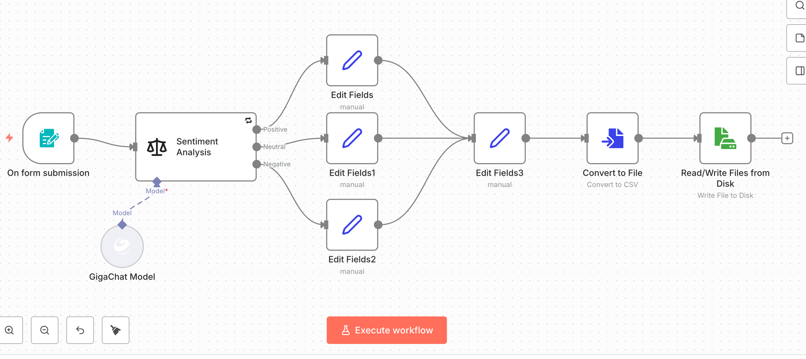

#  workflow на n8n с подключением модуля GigaChat для анализа ответов и запросов пользователей в форме, по 3м критериям и запись финальной распределенной информации в csv

## Проблема
Проблем было много, нужно исследовать и оптимизировать данный флоу.
Во первых как показала практика и отзывы - sentiment не стабильно работает с гига чатом, да и в принципе появилась идея уйти к стабильно развернутым моделям на своем локальном компьютере к примеру в LM Studio. Вторая проблема - запись файла csv.

## Решение
Была создана форма для заполнения отзыва пользователя (триггер) после которого происходит парсинг и распределения на 3 критерия, пока подключил гига чат, дополнительно для увеличения стабильности добавил количество попыток подключения и временной интервал. Для решения второй проблемы необходимо было запустить n8n в докере с дополнительными ключами для создания валуемса, куда и будет записываться csv файл. Запуск докер образа - 
docker run -d \
  --name n8n \
  --restart always \
  -p 5678:5678 \
  -v ~/.n8n:/home/node/.n8n \
  -v ~/n8n_data:/home/node/data \
  n8nio/n8n:1.121.1

  Проверка что в файл произошла запись -  cat ~/n8n_data/reviews.csv   

## Архитектура
После заполнения формы пользователя, работает модуль сентиментного анализа на основании прикрепленной модели (пока что Гига чат), дополнительно которую пришлось донастраивать и писать промт. После этого в зависимости от анализа происходит назначение поля статуса отзыва, мердж всей полученной информации и запись файла (в дальнейшем уйду от csv к гугл таблицам, просто было интересно как он работает с файловой системой)

## Что внутри
- json флоу

- описание работы в readme

## Как использовать
1.Предусловия - локально развернутый и запущенный n8n 
2. Установите Community Node для GigaChat
3. Настройте credentials
4. Импортируйте workflow.json
5. прокиньте порт (к примеру гроком или чем-то другим), запустите. Флоу может быть не стабилен

## Чему научился в процессе
Работать с узлом Sentiment, и подключать к нему модель, конвертировать файл и делать запись в формате csv.