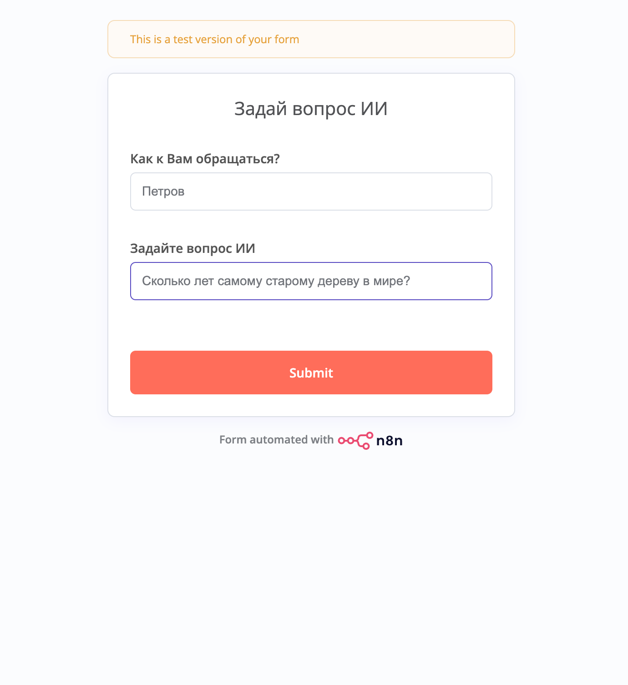
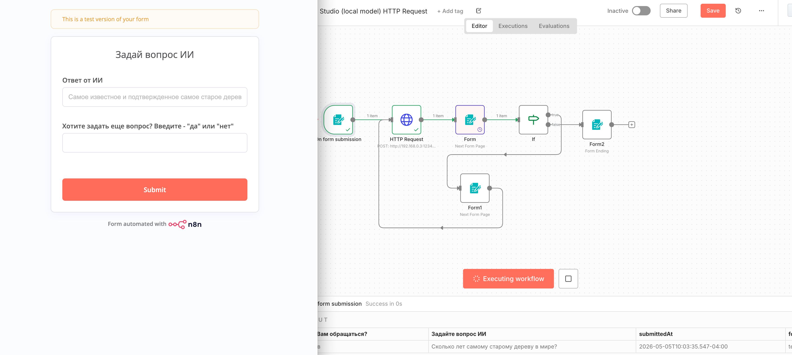
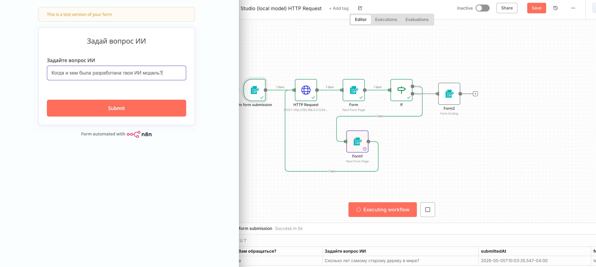
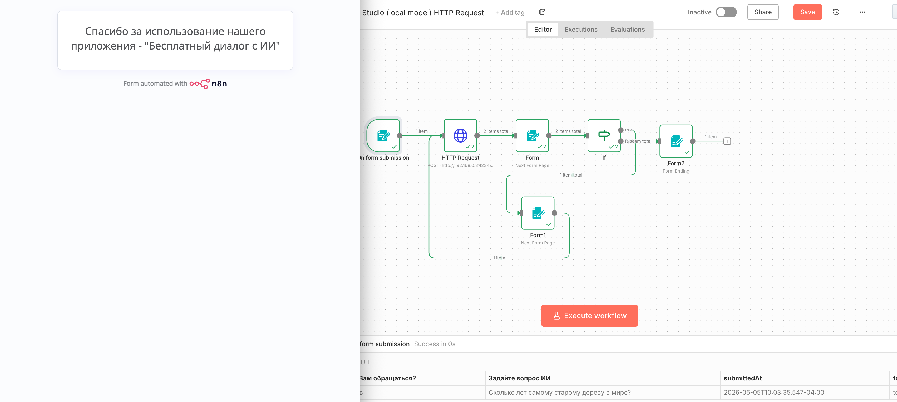

#  workflow на n8n с обращением по http запросу к локально развернутой модели qwen в LM Studio

## Проблема
Для повышения стабильности необходимо использовать локально развернутую модель.

## Решение
Установил и запустил локально в LM Studio qwen, настроил локальный сервер для доступа к ней из вне. В n8n первым блоком идет модуль триггер по заполнению формы, как показано ниже

Я реализовал простое приложение общение с ИИ. Сперва вы задаете вопрос ИИ. триггер срабатывает и запрос отправляется через блок http в котором передается json с телом по адресу к локально развернутой модели. 
Затем открывается новая форма с ответом от ИИ, с двумя полями, в одном ответ, в другое пользователю предлагается ответить на вопрос - Нужен ли доп вопрос к ИИ, если ввести "да", то сработает блок if и мы перейдем на ветку где откроется новая форма с возможностью ввода вопроса.

Если пользователь вводит отличное значение от "да", открывается завершающая форма

## Архитектура
Локально развернутые модели, локально развернутая n8n, все работает предсказуемо без сбоев.

## Что внутри
- json флоу
- описание работы в readme

## Как использовать
1.Предусловия - локально развернутый и запущенный n8n 
2. Локально установленный LM Studio и настроенная модель как сервер
3. Импортируйте workflow.json
5. запустите и общайтесь с ИИ

## Чему научился в процессе
Работать с LM Studio
Создавать разные формы
Работать с блоком HTTP Request
Работать с блоком условий IF