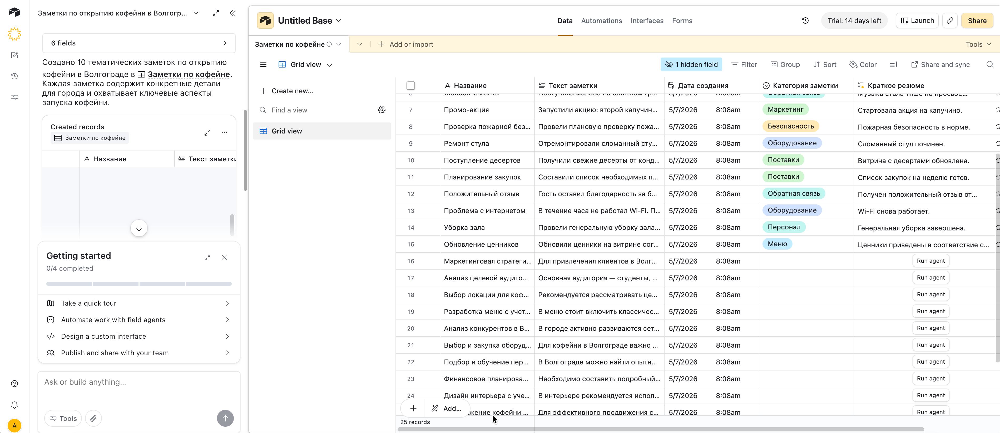
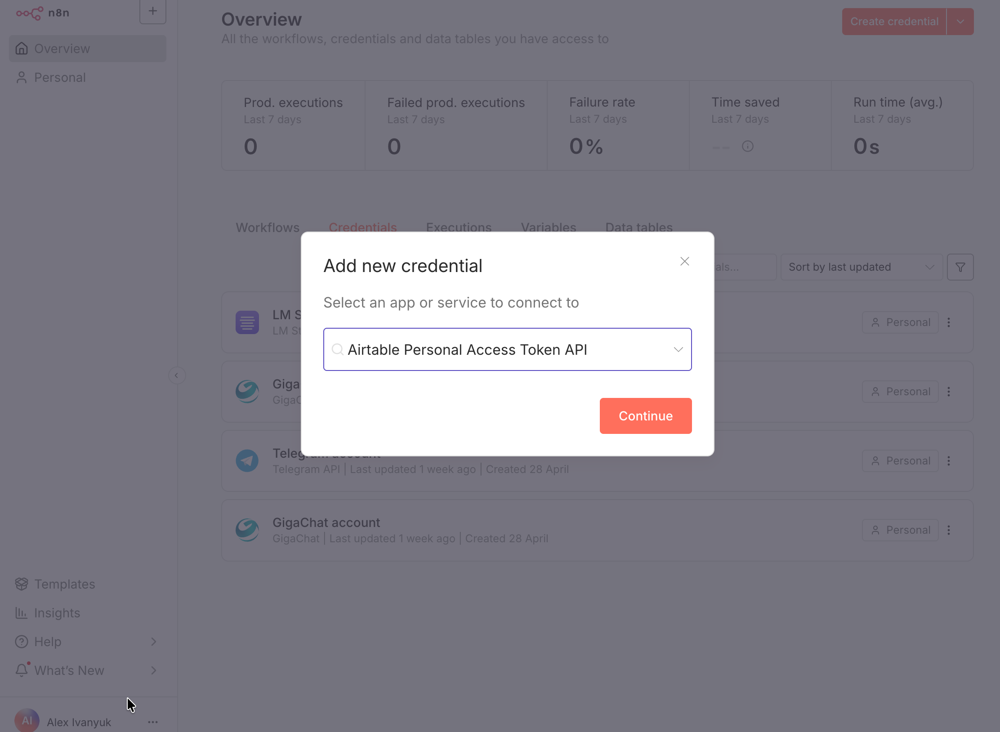
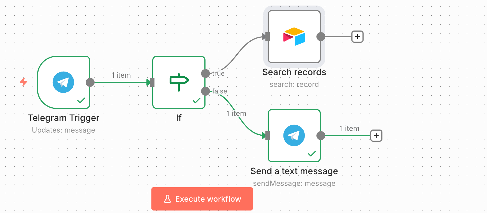
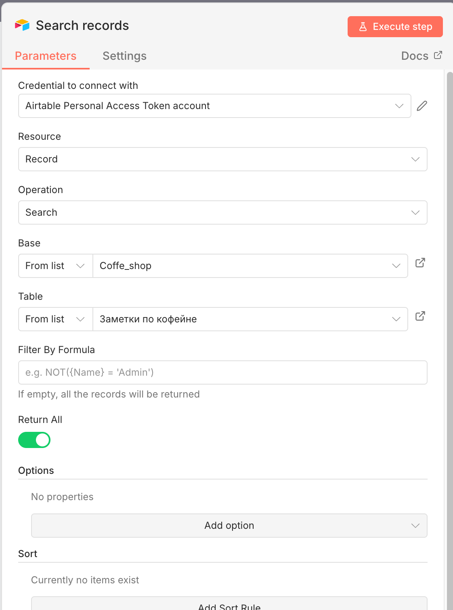
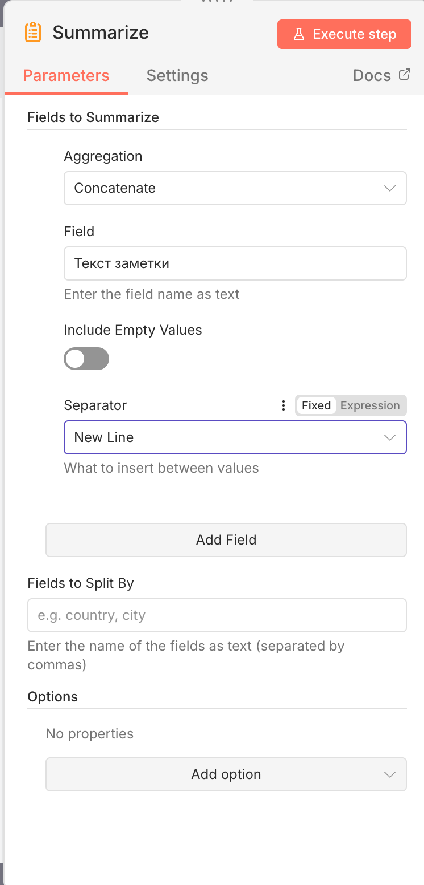
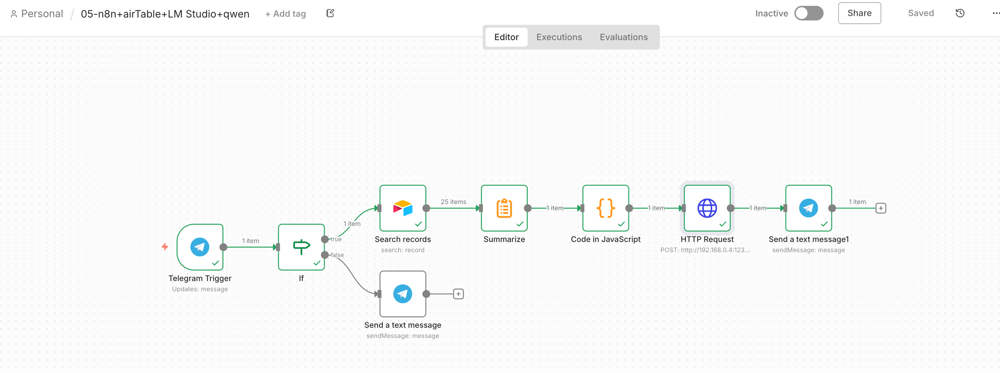
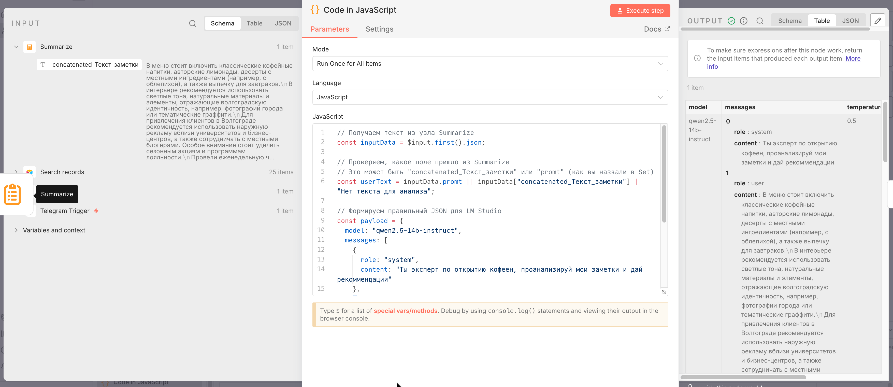

#  workflow на n8n+airTable+LM Studio+qwen

## Проблема
Сделать чат бота который сможет запрашивать информацию у ИИ (локально развернутой для безопасности и эфективности), в свою очередь в которую сгружаются данные с таблицы в облаке.

## Решение

Регистрируемся и создаем с помощью промта и ИИ помощника Omni таблицу для будущего анализа данных (в моем случае это заметки для открытия будущей кофейне)

Затем генерируем токен и идем настраивать в n8n
Добавляем креденшенл

Поскольку мы будем в схеме использовать блок с телеграммом, нам придется прокинуть порт в ngrok и перезапустить контейнер (чтобы автоматом вычитать верный адрес который мы будем использовать в блоке телеги)
docker run -d \
  --name n8n \
  --restart always \
  -p 5678:5678 \
  -v ~/.n8n:/home/node/.n8n \
  -v ~/n8n_data:/home/node/data \
  -e WEBHOOK_URL=https://Ваш адрес выданный ngrok \
  n8nio/n8n:1.121.1
После запуска проверяем что адрес соответствует.

Настраиваем получение запроса от телеграмм бота, проверка/ветвление - или неизвестная команда или идем обращаться к внешней AirTable

Настройка блока Airtable Search

Добавим после блока с поиском по таблице блок объединения информации, для дальнейшей передаче в ИИ (нашей локально развернутой модели нужна не таблица а один единый текст)

После суммаризации нам нужно преобразовать выходные данные с помощью блока код, а только после этого отправлять локальной модели и перенаправлять ответ в телеграмм. Общая структура выглядит так - 

Блок кода - 

Затем идет уже ранее известный блок обращения к локальной модели и отправка ответа в чат бот телеграмма.

## Архитектура

## Что внутри
Флоу и инструкция

## Как использовать
1.Предусловия - локально развернутый и запущенный n8n 
2. Локально установленный LM Studio и настроенная модель как сервер
3. Импортируйте workflow.json
5. запустите и общайтесь с ИИ (предварительно конечно нужно проверить все адресаи наименования, похоже пора задуматься на переменными окружений для удобства)

## Чему научился в процессе
Работать с AirTable и генерацией таблицы с помощью встроенной ИИ omni
Подключение стороннего модуля для работы с данной таблицей
Использование блока суммаризации, а именно механизма канкатенации
Преобразование ответа через блок code 
Обработка разных ответов в телеграмме и вывод ответа

** В дальнейшем надо задуматься над реализацией полноценного меню внутри телеграмма, добавление не только действия search но и остальных CRUD операций. Как заметка на будущее, надо развернуть в докере постгресс и протестить на нем работу с БД.