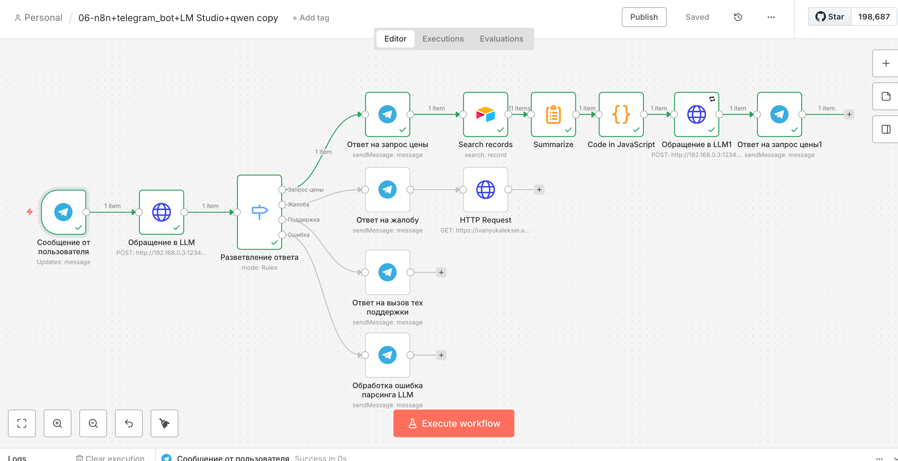
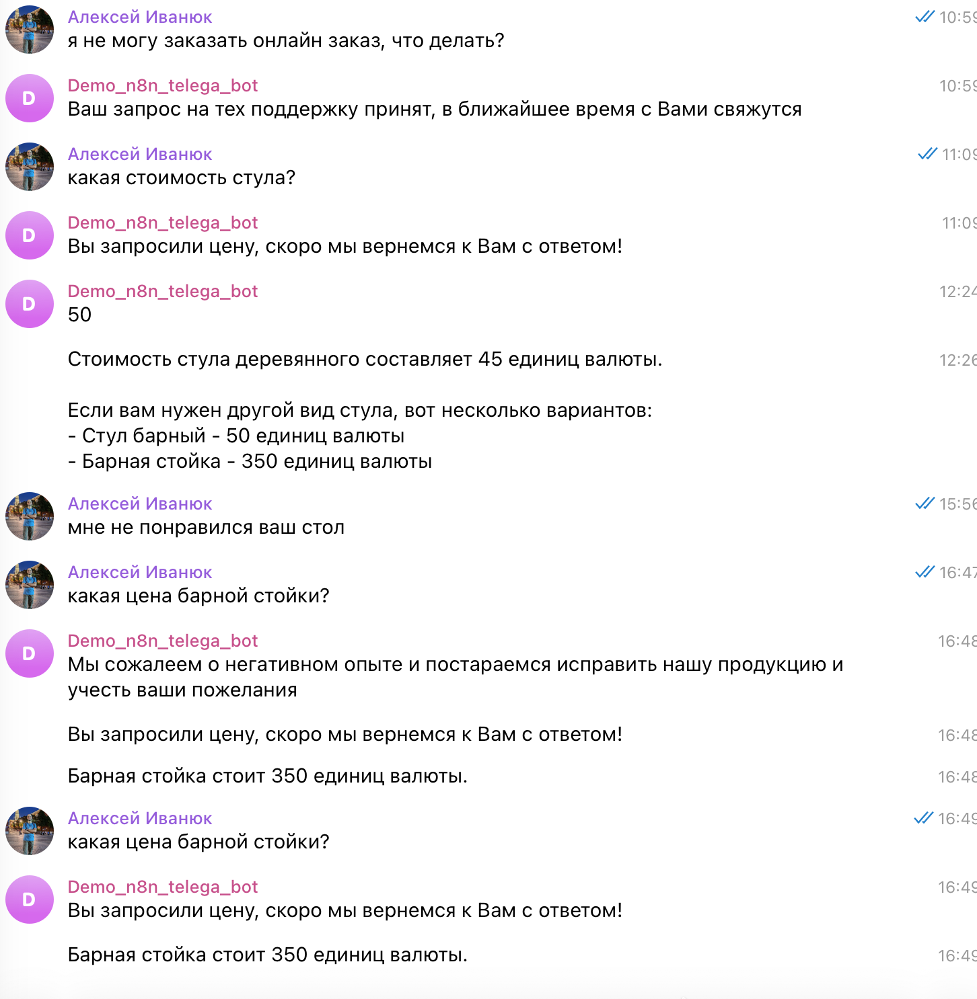
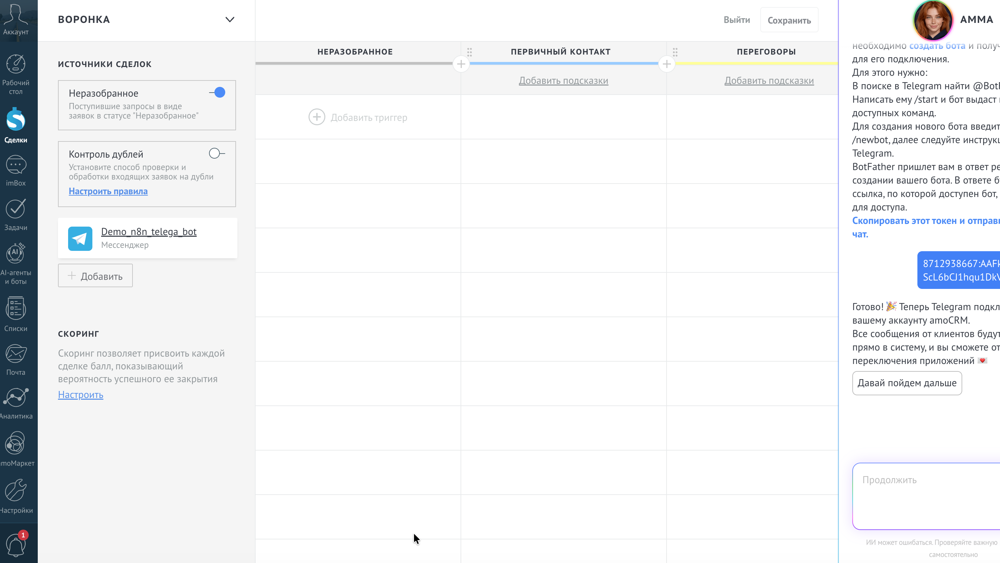
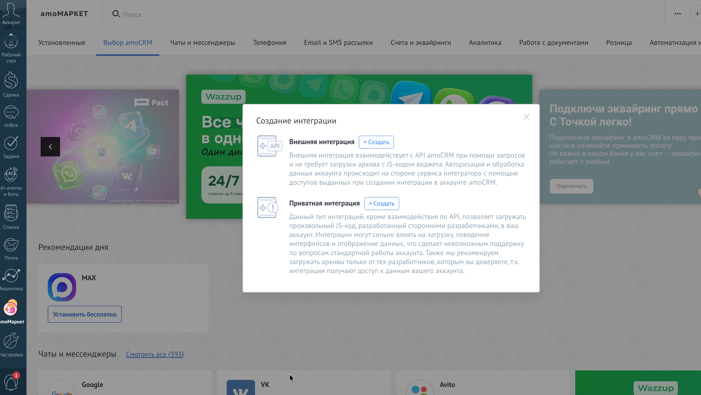
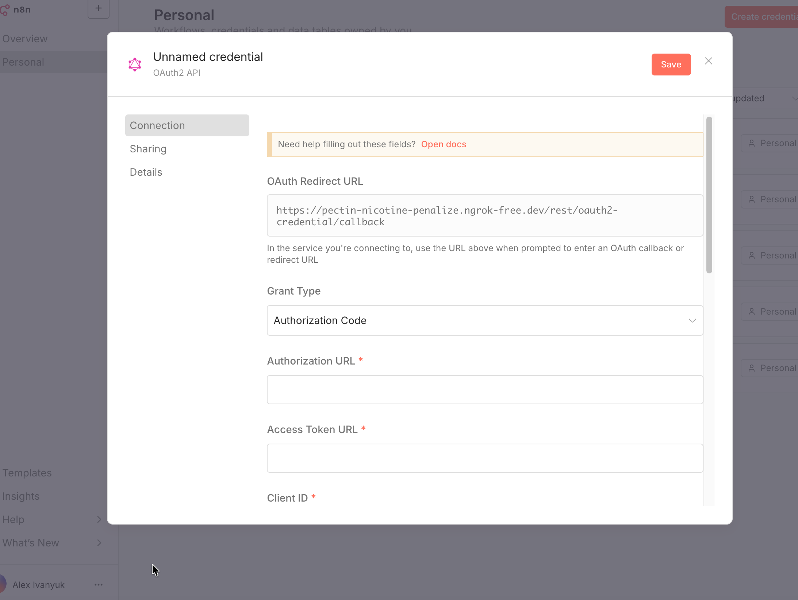
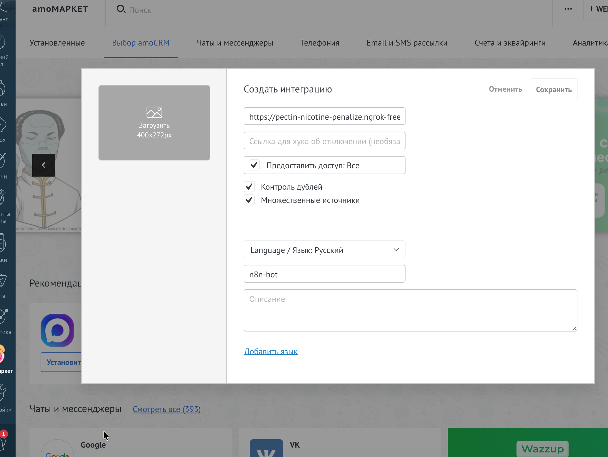
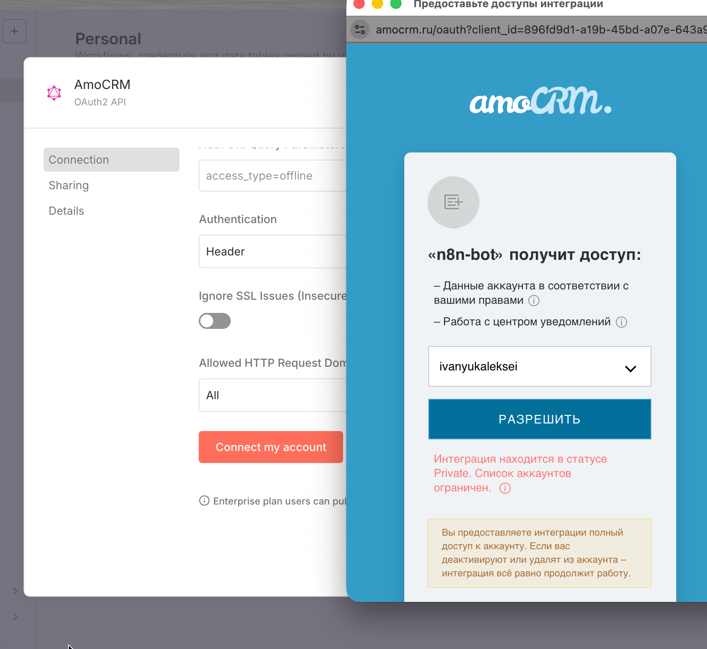

#  workflow на n8n+airTable+LM Studio+qwen+AmoCrm

## Проблема
Необходимо настроить чат бота который умел бы обращаться к облачной таблице с данными, распознавал и классифицировал запрос и в зависимости от классификации выполнял маршрут. В данной реализации основными будут 2 маршрута - первый основной обращение к БД узнать стоимость товара и вернуть пользователю ответ. Второй для изучения - интеграция по протоколу OAUth2 с AmoCRM.

## Решение

Запускаем маршрут, ожидаем события - сообщения от пользователя в телеграмм. Затем обращаемся к локально развернутой модели для парсинга запроса и распределения на 4 критерия, которые реализованы блоком switch. Верхняя цепочка предполагает запрос цены, сначала отправляем пользователю, что запрос принят и скоро придщем с ответом. Затем идем в AitTable и ищем все записи, в блоке суммаризации вытаскиваем и отдаем только нужные значения - товар и стоимость (делаем канкатенацию). В блоке код - преобразуем джейсон, чтобы с ним мог работать LLM. После запрос обрабатывается и отдается ответ обратно в бота телеграмма, как результат - 

Так же первично реализовано подключение (пробное) к AmoCrm

## Архитектура
Локально развернутая модель в LLM + в докере развернутый n8n. Облачная БД и AmoCrm

## Что внутри
Флоу и инструкция

## Как использовать
1.Предусловия - локально развернутый и запущенный n8n 
2. Локально установленный LM Studio и настроенная модель как сервер
3. Импортируйте workflow.json
5. Зарегестрироваться на AmoCrm
. 
Создать интеграцию 

и сделать креденшенелы в нейтоне и AmoCrm

, подключить их в нейтон

